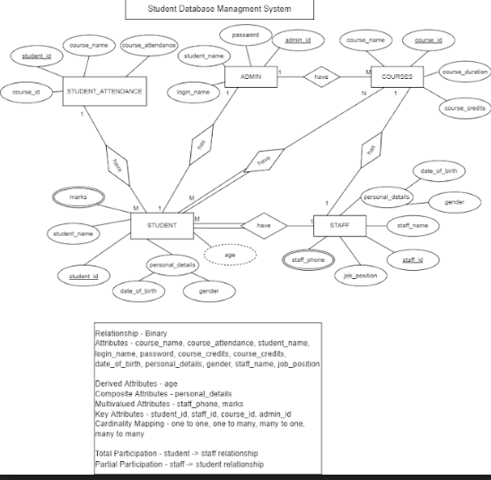

# Student DataBase Management System for DBMS Project 6th Semester 
#### Faculty - Professor S. Ramamoorthy

We are creating a multi platform supported Student Database Management System. We plan to An organised and systematic office solution is essential for all universities and organisations. There are many departments of administration for the maintenance of
college information and student databases in any institution. All these departments
provide various records regarding students. Most of these track records need to
maintain information about the students. This information could be the general details
like student name, address, performance, attendance etc or specific information
related to departments like collection of data. All the modules in college
administration are interdependent. They are maintained manually. So they need to be
automated and centralised as, Information from one module will be needed by other
modules. For example when a student needs his course completion certificate it needs
to check many details about the student like his name, reg number, year of study,
exams he attended and many other details. So it needs to contact all the modules that
are office, department and examination and result of students. With that in mind, we
overhauled the existing Student Database Management System and are going to make
necessary improvement to streamline the processes. Administrators using the system
will find that the process of recording and retrieving students information and
managing their classes, including marking of attendance, will be much easier with our
SQL Database System. In general, this project aims to enhance efficiency and at the
same time maintain information accurateness. We will create the student database
management system in a web and mobile friendly application using the SQL Database
System.

## ER Diagram - 

## Apps Screens done for now - 

#### Login Screen

#### Home Screen

#### Subject Screen

